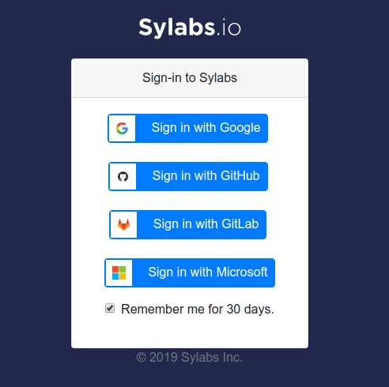

# Prerequisites
To build a container, 

## Install Singularity
For Linux users, you can follow [the installation
instruction](https://github.com/sylabs/singularity/blob/master/INSTALL.md) from
Singularity source code. 

For macOS and Windows users, a Ubuntu-based virtual machine image with
pre-installed Singularity is avaiable here. Please use [VirtualBox
5.2](https://www.virtualbox.org/wiki/Download_Old_Builds_5_2) and follow [this
instruction](https://docs.oracle.com/cd/E26217_01/E26796/html/qs-import-vm.html)
to import a VM to an applicane.

## Sylabs Cloud Services
[Sylabs Cloud Services](https://cloud.sylabs.io/home) support cotainer build, sharing, signing and validation.

### Sign up Sylabs Cloud Serivce
Sylabs support several sign-up options. GitHub or GitLab are recommended.

### Create a access token to authenticate with Sylabs services
Click __Account__ | __Access Tokens__ and then enter a label for a new access
token. Put the token into a file in your home directory named
`~/.singularity/sylabs-token`.
